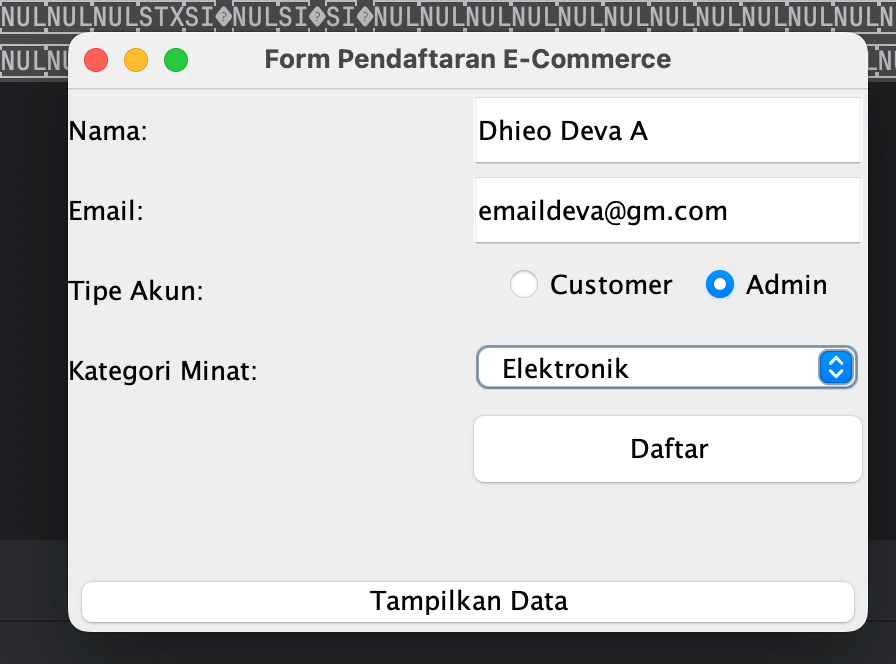
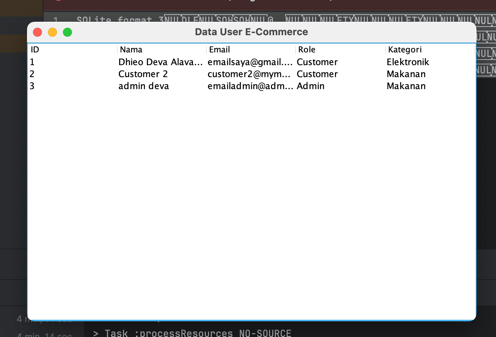

# Tugas PBO OOP Ecommerce

Aplikasi desktop Java sederhana untuk **manajemen pengguna e-commerce** yang dibuat dengan penerapan konsep dasar Pemrograman Berorientasi Objek (OOP) seperti constructor, inheritance, polymorphism, encapsulation, interface, package, dan exception handling.

Aplikasi ini menggunakan Java Swing untuk antarmuka grafis dengan komponen seperti **radio button** dan **combo box**, serta terhubung ke database SQLite untuk penyimpanan data secara lokal.

## Fitur

- Form pendaftaran pengguna menggunakan radio button dan combo box
- Penyimpanan data pengguna ke database SQLite
- Tampilan daftar pengguna yang telah terdaftar
- Dukungan multi-role (admin dan customer)
- Penanganan exception pada koneksi database dan validasi input user

## Studi Kasus

Studi kasus yang dipilih adalah **e-commerce**, dengan fokus pada pengelolaan data pengguna yang bermanfaat bagi pengguna dan administrator aplikasi.

## 📸 Screenshot

### 📝 Form Pendaftaran


### Daftar Pengguna Terdaftar 📝 


## Struktur Proyek

```
📦 Proyek Struktur
├── 🛠️ build.gradle
├── 🛠️ settings.gradle
├── 📄 .gitignore
├── ⚙️ gradlew / gradlew.bat
├── ⚙️ gradle/wrapper/
├── 🗄️ ecommerce.db *(otomatis dibuat saat pertama dijalankan)*
└── 📁 src/main/java/main/
    ├── 🚀 App.java
    ├── 📁 interfaceku/
    │   └── 📝 DaftarAkun.java
    ├── 📁 model/
    │   ├── 👤 Admin.java
    │   ├── 👤 Customer.java
    │   ├── 👤 User.java
    │   └── 🧾 UserData.java
    ├── 📁 service/
    │   └── 🔧 DatabaseService.java
    └── 📁 ui/
        ├── 🧾 FormPendaftaran.java
        └── 📊 TampilData.java

```

## Prasyarat

- Java 17 atau lebih tinggi
- Gradle (bisa pakai wrapper: `./gradlew`)

## Menjalankan Aplikasi

### 1. Clone Repository

```bash
git clone https://github.com/alavanta/Tugas-PBO-OOP-Ecommerce.git
cd Tugas-PBO-OOP-Ecommerce
```

### 2. Build dan Jalankan

Gunakan Gradle wrapper:

```bash
./gradlew run
```

Atau jika menggunakan Windows:

```bash
gradlew.bat run
```

### 3. Jalankan dari IDE

Jika menggunakan IntelliJ IDEA:
- Buka folder proyek
- Pastikan Gradle menggunakan Java 17 (periksa Project SDK dan Toolchain)
- Jalankan `App.java` sebagai `Application`

## Catatan

- File database `ecommerce.db` akan dibuat secara otomatis di direktori proyek saat aplikasi pertama kali dijalankan.
- Pastikan `sqlite-jdbc` dependency berhasil didownload saat build (tersedia di `build.gradle`).

## Lisensi

Proyek ini dibuat untuk tujuan pembelajaran. Bebas digunakan dan dimodifikasi sesuai kebutuhan.
